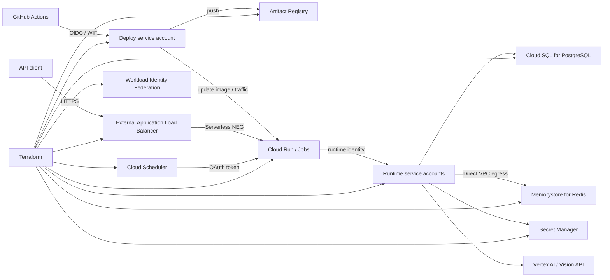

# stock-infra

株式情報アプリケーションの本番GCP基盤を、Terraformで再現可能に構築するためのInfrastructure as Codeリポジトリです。

> Status: 本番GCP基盤を構築済みです。このリポジトリには実環境の識別子や認証情報を含めていません。

## このリポジトリで示すこと

- GCPプロジェクトのbootstrapからアプリケーション基盤までを段階的に管理する構成
- GitHub ActionsとWorkload Identity Federationによるサービスアカウントキー不要のCD認証
- Cloud Runのサービス用・バッチ用・デプロイ用に責務を分けた最小権限IAM
- Secret ManagerとTerraform stateの特性を踏まえた秘密情報の管理
- 小規模サービスで可用性・復旧性・月額コストを明示的に選択する設計
- 本番リソースに対する削除保護と、破壊的変更を人間が確認する運用

## アーキテクチャ



詳細は [docs/architecture.md](docs/architecture.md) を参照してください。

## 責務境界

| 担当 | 管理対象 |
|---|---|
| Terraform | Cloud Runサービス・Jobsとその設定、API独自ドメイン用ロードバランサー・証明書、Cloud Scheduler、GCPプロジェクト、stateバケット、API、Cloud SQL、Memorystore、Artifact Registry、Secret Manager、サービスアカウント、IAM、WIF |
| DNS事業者 | Terraform outputが示すAレコードと証明書認証用CNAMEの登録 |
| backend GitHub Actions CD | コンテナイメージのbuild/push、既存Cloud Runリソースのイメージ更新、APIのtraffic切替、Job実行 |

Cloud Runの環境変数、Secret参照、ネットワーク、ランタイムSA、リソース制限、Job引数はTerraformで管理します。
Cloud Run等の配置先は `region`、Vertex AI Geminiの呼び出し先は `vertex_ai_location` で個別に設定します。
CDと共有するのはコンテナイメージとServiceのtrafficだけであり、この2属性に限定して
`lifecycle.ignore_changes` を設定します。これによりアプリケーションのリリース速度を保ちつつ、
それ以外の設定driftをTerraform planで検出します。

バッチは単一のCloud Run Job `batch` として構築し、`candles` / `logo` /
`auth-session-cleanup` は実行時の `job_id` 引数で切り替えます。

`candles` は毎日7:00 JST、`logo` は毎週日曜10:00 JSTにCloud Schedulerが自動実行します。
`auth-session-cleanup` は現時点で定期実行を設定していません。

## 主な設計判断

### bootstrapと本番リソースを分離

GCPプロジェクトとtfstateバケットを作る `bootstrap`、アプリケーション基盤を作る `prod` を別のTerraform rootにしています。プロジェクトIDが未決定でもコードを公開でき、基盤のライフサイクルも分離できます。

### キーレスなデプロイ認証

GitHub ActionsからGCPへの認証にはWIFを利用します。長期間有効なサービスアカウントJSONキーを発行せず、許可するGitHubリポジトリとGit refをOIDC claimで制限します。

### 最小権限IAM

- API、バッチ、マイグレーションでランタイムサービスアカウントを分離
- Secret Managerの参照権限はプロジェクト単位ではなくシークレット単位
- Artifact Registryへの書き込みは対象リポジトリ単位
- `serviceAccountUser` はデプロイで使用するランタイムサービスアカウント単位

### APIの独自ドメイン

APIの独自ドメインは、固定グローバルIPv4、外部Application Load Balancer、
Serverless NEG、Certificate ManagerのGoogle管理証明書で構成します。
DNSと証明書の疎通確認後にCloud Runのingressをロードバランサー経由へ限定し、
切り替え中の到達性を維持します。証明書が `ACTIVE` になるまではCloud Runの直接公開を
維持し、独自ドメインのHTTPS疎通後に入口を制限します。実ドメインはローカルの
`terraform.tfvars` にだけ保存します。

### コストと可用性のトレードオフ

個人開発規模を前提に、Cloud SQLはzonal・共有コア、RedisはBasic構成を選びます。PITRやHAより予測可能なコストを優先していますが、バックアップ保持、削除保護、Artifact Registryのクリーンアップは有効にします。要件が変わった場合は、この判断を再評価します。

### シークレットの管理

シークレットは生成値・リソースからの導出値・手動投入する外部credentialに分類します。実値はリポジトリに保存しません。Terraformが扱う生成値はstateに保存されるため、stateバケットでは公開アクセス禁止、Uniform bucket-level access、バージョニング、削除防止を設定します。

詳細は [docs/security.md](docs/security.md) を参照してください。

## ディレクトリ構成

```text
.
├── README.md
├── AGENTS.md
├── docs/
│   ├── architecture.md
│   ├── operations.md
│   └── security.md
└── terraform/
    ├── bootstrap/             # GCPプロジェクトとstateバケット
    └── environments/
        └── prod/              # アプリケーションの本番GCP基盤
```

現在は本番1環境かつリソース数も限定的なため、再利用を目的としない細かなmodule分割はしていません。ステージング環境の追加や複数プロジェクトへの展開が必要になった時点で共通moduleを抽出します。

## セットアップ概要

実値を含む設定ファイルはコミットしません。各Terraform rootのサンプルをコピーしてローカルで編集します。

```bash
cp terraform/bootstrap/terraform.tfvars.example terraform/bootstrap/terraform.tfvars
cp terraform/environments/prod/terraform.tfvars.example terraform/environments/prod/terraform.tfvars
cp terraform/environments/prod/backend.hcl.example terraform/environments/prod/backend.hcl
```

初回構築とstate移行を含む手順は [docs/operations.md](docs/operations.md) に記載しています。

## 検証

```bash
terraform fmt -check -recursive

terraform -chdir=terraform/bootstrap init -backend=false
terraform -chdir=terraform/bootstrap validate

terraform -chdir=terraform/environments/prod init -backend=false
terraform -chdir=terraform/environments/prod validate
```

認証済み環境では、各rootで `terraform plan` を実行して変更内容を確認します。`apply` はplanを人間が確認した後にのみ実行します。

## 公開情報の方針

| 公開する | ローカルのみに保存 | 保存しない |
|---|---|---|
| Terraformコード、設計文書、example設定 | プロジェクトID、課金・組織情報、stateバケット名、実リポジトリ名 | APIキー、パスワード、秘密鍵、サービスアカウントキー、tfstate |

公開前の判断基準は [docs/security.md](docs/security.md) にまとめています。

## 技術スタック

- Terraform 1.9以上
- Google Cloud Provider 6.x
- Google Cloud: Cloud Run、Cloud Load Balancing、Certificate Manager、Cloud SQL、Memorystore、Artifact Registry、Secret Manager、IAM、WIF
- GitHub Actions / OpenID Connect

## 関連コンポーネント

アプリケーションは、Go製API・バッチとWebフロントエンドで構成します。接続先のGitHubリポジトリは環境固有値としてローカルの `terraform.tfvars` から設定します。
