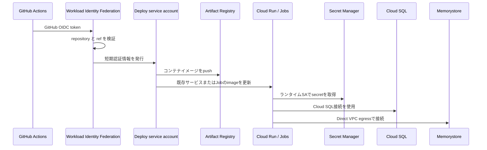
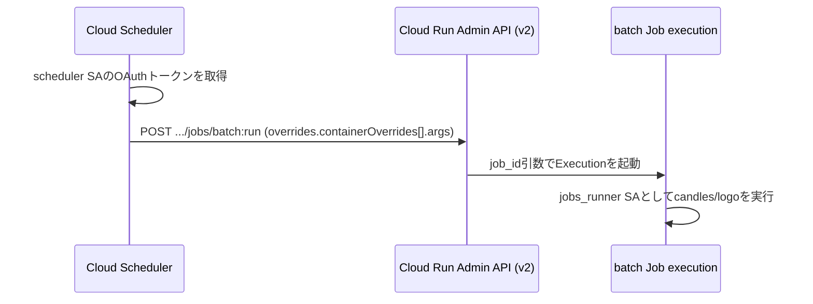

# アーキテクチャ

## スコープ

このリポジトリはGCPプロジェクトのbootstrapと、Cloud Runを含むアプリケーションの本番基盤を管理する。アプリケーションコード、ローカル開発環境、コンテナイメージの継続的なデプロイは対象外とする。

## Terraform root

### bootstrap

`terraform/bootstrap` は次を管理する。

- GCPプロジェクト
- 課金アカウントとの関連付け
- bootstrapに必要なAPI
- Terraform state用GCSバケット

プロジェクトとstateバケットには削除防止を設定する。初回だけローカルstateで作成し、バケット作成後にbootstrap自身のstateもGCSへ移行する。

### prod

`terraform/environments/prod` は次を管理する。

- 利用するGCP API
- default VPCとサブネットの参照
- Cloud SQL for PostgreSQL
- Memorystore for Redis
- Artifact Registry
- Secret Manager
- ランタイム・デプロイ用サービスアカウント
- IAM
- GitHub Actions用Workload Identity Federation
- Cloud Run APIサービス
- 単一のCloud Run batch Jobとmigrate Job
- batch Jobを定期実行するCloud Scheduler
- Cloud Runの環境変数、Secret参照、ネットワーク、リソース制限

## リクエストとデプロイの流れ

## Cloud Runの共同管理境界

TerraformはCloud Runリソースを作成し、環境変数、Secret参照、ネットワーク、リソース制限、
ランタイムSA、Job引数を継続管理する。backend CDはcommit SHA付きイメージの更新と、
APIのtraffic切替、Job実行だけを担当する。TerraformではコンテナイメージとServiceのtrafficだけを
`ignore_changes` とし、それ以外の設定driftを検出する。

Cloud Runは作成時にイメージが必要なため、初回だけbackend CDを `publish_only` で実行して
Artifact Registryへpushし、そのURIを `initial_*_image` 変数としてTerraformへ渡す。

## 定期実行（Cloud Scheduler）

candlesは毎日7:00 JST、logoは毎週日曜10:00 JSTに、Cloud SchedulerがCloud Run Admin API v2の
`projects.locations.jobs.run` をHTTPターゲットとして呼び出し、単一batch Jobの実行を起動する。

scheduler SAには対象Job単位で `roles/run.jobsExecutorWithOverrides` を付与する。
`roles/run.invoker` にはJob実行時の上書き権限（`run.jobs.runWithOverrides`）が含まれないため使用しない。

Cloud SchedulerのHTTP呼び出しはExecutionの起動をキューイングして即座に応答するため、
Job本体のtimeout（10800秒）とは独立した短い `attempt_deadline` を設定する。
backend CDや `gcloud run jobs execute` による手動実行とは独立したトリガーであり、互いを待ち合わせない。

## ネットワーク

- Cloud SQLはCloud Run組み込み接続を利用する
- Redisはdefault VPC内に配置する
- Redisを利用するAPIと、candlesを実行できる単一batch JobがDirect VPC egressを利用する
- 常時稼働コストが発生するServerless VPC Accessコネクタは使用しない
- RedisはVPC内通信に限定し、AUTHを有効にする

## 拡張方針

本番以外の環境や複数プロジェクトへの展開が必要になった場合は、`terraform/environments/<environment>` を追加し、重複が明確になった段階で共通moduleを抽出する。
