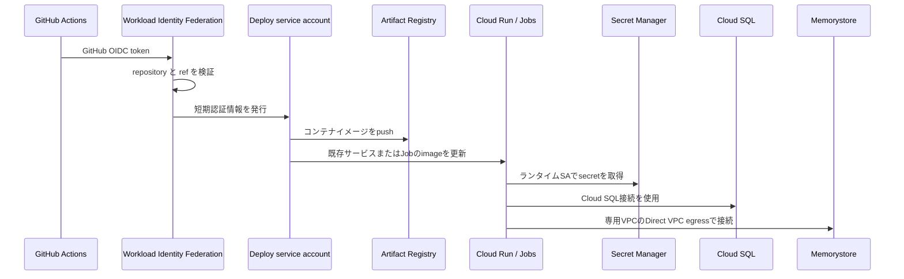
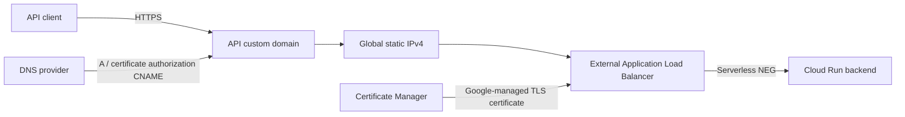
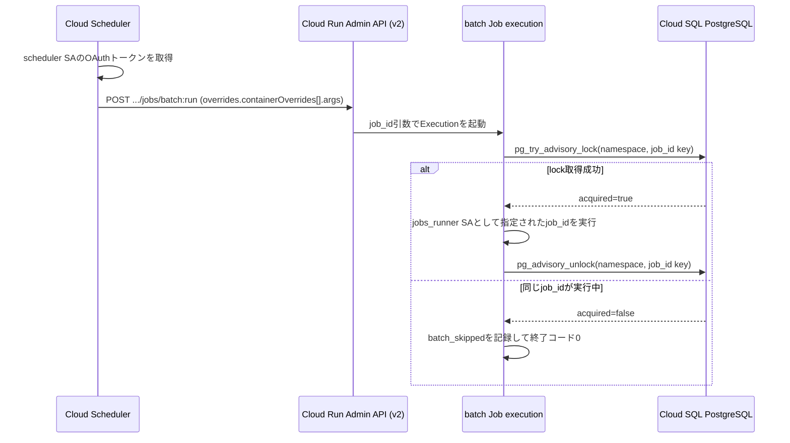

# アーキテクチャ

## スコープ

このリポジトリはGCPプロジェクトのbootstrapと、Cloud Runを含むアプリケーションの本番基盤を管理する。アプリケーションコード、ローカル開発環境、コンテナイメージの継続的なデプロイは対象外とする。

## Terraform root

### bootstrap

`terraform/bootstrap` は次を管理する。

- GCPプロジェクト
- 課金アカウントとの関連付け
- bootstrapに必要なAPI
- Terraform state用GCSバケット

プロジェクトとstateバケットには削除防止を設定する。初回だけローカルstateで作成し、バケット作成後にbootstrap自身のstateもGCSへ移行する。

### prod

`terraform/environments/prod` は次を管理する。

- 利用するGCP API
- 本番専用custom-mode VPCとCloud Run用サブネット
- Cloud SQL for PostgreSQL
- Memorystore for Redis
- Artifact Registry
- Secret Manager
- ランタイム・デプロイ用サービスアカウント
- IAM
- GitHub Actions用Workload Identity Federation
- Cloud Run APIサービス
- API独自ドメイン用の外部Application Load Balancer、固定IP、Google管理TLS証明書
- 単一のCloud Run batch Jobとmigrate Job
- batch Jobを定期実行するCloud Scheduler
- Cloud MonitoringのUptime Checkとalert policy
- Cloud Runの環境変数、Secret参照、ネットワーク、リソース制限

## リクエストとデプロイの流れ

```mermaid
sequenceDiagram
    participant GH as GitHub Actions
    participant WIF as Workload Identity Federation
    participant SA as Deploy service account
    participant AR as Artifact Registry
    participant RUN as Cloud Run / Jobs
    participant SM as Secret Manager
    participant SQL as Cloud SQL
    participant REDIS as Memorystore

    GH->>WIF: GitHub OIDC token
    WIF->>WIF: repository と ref を検証
    WIF->>SA: 短期認証情報を発行
    SA->>AR: コンテナイメージをpush
    SA->>RUN: 既存サービスまたはJobのimageを更新
    RUN->>SM: ランタイムSAでsecretを取得
    RUN->>SQL: Cloud SQL接続を使用
    RUN->>REDIS: 専用VPCのDirect VPC egressで接続
```

## Cloud Runの共同管理境界

TerraformはCloud Runリソースを作成し、環境変数、Secret参照、ネットワーク、リソース制限、
ランタイムSA、Job引数を継続管理する。backend CDはcommit SHA付きイメージの更新と、
APIのtraffic切替、Job実行だけを担当する。TerraformではコンテナイメージとServiceのtrafficだけを
`ignore_changes` とし、それ以外の設定driftを検出する。

Cloud Runは作成時にイメージが必要なため、初回だけbackend CDを `publish_only` で実行して
Artifact Registryへpushし、そのURIを `initial_*_image` 変数としてTerraformへ渡す。

## APIの公開経路

```mermaid
flowchart LR
    CLIENT["API client"] -->|"HTTPS"| DNS["API custom domain"]
    DNS --> IP["Global static IPv4"]
    IP --> LB["External Application Load Balancer"]
    LB -->|"Serverless NEG"| RUN["Cloud Run backend"]
    CM["Certificate Manager"] -->|"Google-managed TLS certificate"| LB
    DNSP["DNS provider"] -->|"A / certificate authorization CNAME"| DNS
```

外部Application Load BalancerはHTTPをHTTPSへリダイレクトし、TLS 1.2以上で通信を終端する。
証明書はCertificate ManagerのDNS認証で発行・更新する。DNSのAレコードと認証用CNAMEは
Terraform outputを正とし、DNS事業者側で人間が登録する。
認証用CNAMEは証明書の自動更新にも使うため、初回発行後も削除しない。

Serverless NEGをbackendに持つBackend Serviceは `timeout_sec` をサポートしない。
リクエストタイムアウトはCloud Run Service側で管理し、Backend Serviceに重複設定しない。

切り替えは次の2段階で行う。

1. `enable_api_domain = true` でロードバランサーを作成し、Cloud Runの直接公開は維持する
2. DNS反映、証明書の `ACTIVE`、HTTPS疎通を確認後、`restrict_api_to_load_balancer = true` で外部通信をロードバランサー経由に限定する

固定IPはDNSの参照先であるため `prevent_destroy` で誤削除を防ぐ。切り替え後は
独自ドメイン経由の応答と、インターネットからのCloud RunデフォルトURIが拒否されることの
両方を確認する。

## 定期実行（Cloud Scheduler）

auth-session-cleanupは毎日3:30 JST、candlesは毎日7:00 JST、logoは毎週日曜10:00 JSTに、
Cloud SchedulerがCloud Run Admin API v2の `projects.locations.jobs.run` をHTTPターゲットとして呼び出し、
単一batch Jobの実行を起動する。

```mermaid
sequenceDiagram
    participant SCHED as Cloud Scheduler
    participant RUN as Cloud Run Admin API (v2)
    participant JOB as batch Job execution
    participant DB as Cloud SQL PostgreSQL

    SCHED->>SCHED: scheduler SAのOAuthトークンを取得
    SCHED->>RUN: POST .../jobs/batch:run (overrides.containerOverrides[].args)
    RUN->>JOB: job_id引数でExecutionを起動
    JOB->>DB: pg_try_advisory_lock(namespace, job_id key)
    alt lock取得成功
        DB-->>JOB: acquired=true
        JOB->>JOB: jobs_runner SAとして指定されたjob_idを実行
        JOB->>DB: pg_advisory_unlock(namespace, job_id key)
    else 同じjob_idが実行中
        DB-->>JOB: acquired=false
        JOB->>JOB: batch_skippedを記録して終了コード0
    end
```

scheduler SAには対象Job単位で `roles/run.jobsExecutorWithOverrides` を付与する。
`roles/run.invoker` にはJob実行時の上書き権限（`run.jobs.runWithOverrides`）が含まれないため使用しない。

Cloud SchedulerのHTTP呼び出しはExecutionの起動をキューイングして即座に応答するため、
Job本体のtimeout（10800秒）とは独立した短い `attempt_deadline` を設定する。
backend CDや `gcloud run jobs execute` による手動実行とは独立したトリガーであり、複数Executionを
作成できる。batchは処理開始前に`job_id`単位のセッションレベルadvisory lockを待機なしで取得し、
同じ`job_id`の先行Executionが実行中なら、後続Executionは`event=batch_skipped`、
`reason=already_running`を記録して終了コード0で安全に終了する。lock取得処理自体のエラーは
`event=batch_lock_failed`を記録して終了コード1とし、Cloud RunとSchedulerのretry対象にする。

| job_id | 同じjob_idの同時起動 | 先行Execution終了後の再実行 |
|---|---|---|
| `candles` | 後続を処理開始前に正常終了 | 許可。既存データは複合主キーによるupsert |
| `logo` | 後続を処理開始前に正常終了 | 許可。同じ銘柄行のロゴURLを再更新 |
| `auth-session-cleanup` | 後続を処理開始前に正常終了 | 許可。削除済みセッションは対象にならない |

異なる`job_id`は別のlock keyを使うため並行実行できる。lock専用DB接続はExecutionの終了まで保持し、
正常終了時は同じセッションでunlockする。プロセスや接続の異常終了時もPostgreSQLがセッションlockを
解放する。完了後の再実行は、Cloud Runのタスクretryや障害復旧、バックフィルを妨げないため許可する。
Schedulerの`retry_count = 3`とCloud Run Jobの`max_retries = 1`は無効化せず、排他と各DB更新の
冪等性を組み合わせて安全性を保つ。

## 監視と通知

Cloud Monitoringで次の症状を監視する。

- Cloud SQLのディスク使用率80%超過と接続数20以上
- Cloud Run APIの5xx率5%超過とp95レイテンシ2秒超過
- Cloud Run batch / migrate Jobの失敗
- Cloud Schedulerの`AttemptFinished` ERRORログ
- 独自ドメイン`/healthz`の複数拠点からの到達不能

メトリクスは5分の継続時間または集計窓を基本とし、一時的な揺らぎによる通知ノイズを抑える。
Job失敗とScheduler失敗は単発でも対応が必要なため即時検知し、Schedulerのログベース通知には
1時間のrate limitを設定する。

Slack通知チャネルはCloud MonitoringとSlackのOAuth連携を必要とする。OAuth tokenを
`terraform.tfvars`やTerraform stateへ保存しないため、チャネルはGCP Consoleで人間が作成する。
Terraformは`slack_notification_channel_id`に設定したresource nameだけをalert policyから参照する。

## ネットワーク

- Cloud SQLはCloud Run組み込み接続を利用する
- Redisは本番専用のcustom-mode VPC内に配置する
- Redisを利用するAPIと、candlesを実行できる単一batch Jobが同じ専用subnetからDirect VPC egressを利用する
- subnetはCloud RunのIP予約とRevision切り替えを考慮し、最低でも`/26`を確保する
- API Revisionとbatch Executionに専用network tagを付け、egress firewallは新RedisのTCP portだけを許可する
- 専用VPCは暗黙のegress allowに依存せず、上記以外のVPC向け通信を優先度の低いdeny ruleで拒否する
- 常時稼働コストが発生するServerless VPC Accessコネクタは使用しない
- RedisはVPC内通信に限定し、AUTHを有効にする

構築済み環境のRedisはauthorized networkの変更で再作成せず、次のフェーズで移行する。

| フェーズ | 専用VPC・Redis | Cloud Runの接続先 |
|---|---|---|
| `legacy` | 未作成 | default VPC上の旧Redis |
| `prepare` | 旧環境と並行作成 | default VPC上の旧Redis |
| `cutover` | 維持 | 専用VPC上の新Redis |

専用Redisの接続情報は既存`REDIS_*`を上書きせず、別のSecretと数値versionで作成する。
cutoverはCloud Run Service / Jobのnetwork interfaceとSecret参照を同じRevision更新で切り替える。
rollbackは`prepare`へ戻すことで旧ネットワークと旧Secretを再参照し、新Redisは調査用に保持する。
旧Redisとdefault VPCの削除はrollback期間終了後の独立した変更であり、この移行には含めない。

## 拡張方針

本番以外の環境や複数プロジェクトへの展開が必要になった場合は、`terraform/environments/<environment>` を追加し、重複が明確になった段階で共通moduleを抽出する。
